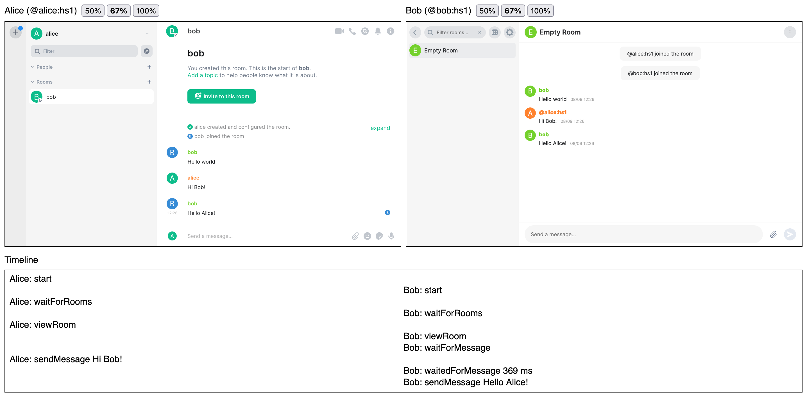

# Patience

[](https://github.com/matrix-org/patience/actions/workflows/ci.yml)
[](https://matrix.to/#/#matrix-patience:matrix.org)

Full stack integration testing for Matrix clients and servers



## Features

* Client specifics are hidden by default (but still accessible) so tests can
  target many clients without modification
* Tests written in TypeScript
* Report mode gives a quick summary of results in your terminal
* Interactive mode allows you to try out and debug the clients in your browser
* Builds on top of [Complement's `homerunner` API](https://github.com/matrix-org/complement/tree/master/cmd/homerunner)
* Test harness displays all clients together on one page

## Supported environments

Patience aims to support testing different combinations of Matrix clients and
servers in a unified environment.

At the moment, Element Web is the only supported client, but anything that fits
in an `iframe` should be easy to add. Tools such as
[Appetize](https://appetize.io/) could be used to add mobile clients.

Synapse and Dendrite are the currently supported homeservers.

## Usage

Setup is currently a bit manual, as this project is just getting started. If you
have suggestions on how to improve setup, please file an issue.

To get started with Patience in your project, first collect the following bits
and bobs:

- Docker
- Go
- Node.js
- `homerunner` from [Complement](https://github.com/matrix-org/complement)
  - `go install github.com/matrix-org/complement/cmd/homerunner@latest`
- One or more Complement-ready [homeserver
  images](https://github.com/matrix-org/complement#running-against-dendrite)
- Chrome
  - We plan to switch to Playwright in the future to support additional browsers

Create a directory to hold your tests and add Patience:

`npm add @matrix-org/patience --save-dev`

Add a test, perhaps by copying [`hello.ts`](./examples/hello.ts). At a minimum,
you should call `orchestrate` to set up servers, clients, and rooms for your
test. Most likely you'll want to actually test something too.

To run your tests in reporting mode:

`npx patience '*.ts'`

You should see:

```
Finished running tests, all tests passed! 🎉
```

To run your tests in interactive mode:

`npx patience '*.ts' -- --manual`

This will start a server at `localhost:8000` which you can navigate to in your
browser. Click on one of listed test files to watch the test run. You can
interact with the clients, timeline, etc. The clients remain after for
exploration until you stop the server.
